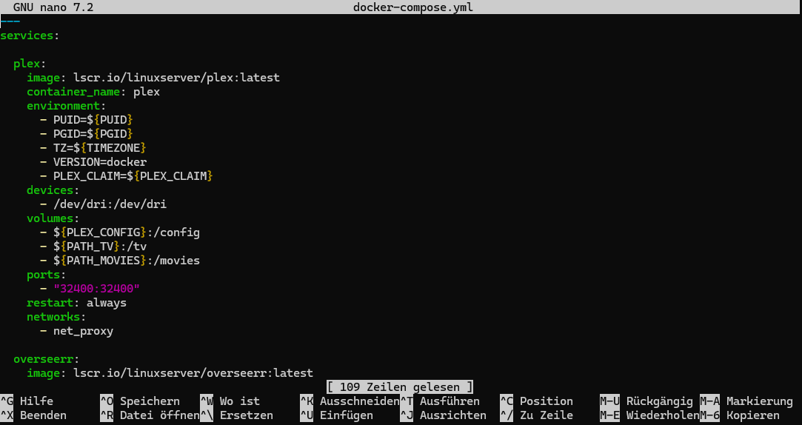
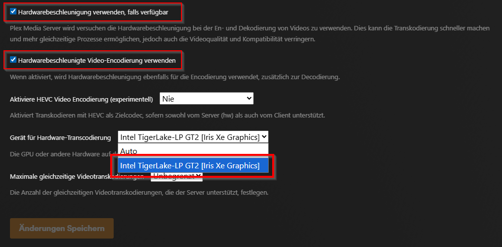

## 🧠 Intel iGPU Hardware Transcoding aktivieren (Plex Pass)
**💡 Hinweis: Diese Anleitung ist nur für Intel iGPU Onboard-Grafikkarten!**

Wenn Medien in Plex nicht über "Direct Play" abgespielt werden können, müssen sie während der Wiedergabe vom Server in ein passendes Format transkodiert werden. Standardmäßig läuft diese Transkodierung über die CPU, die im Vergleich zu einer GPU deutlich langsamer und rechenintensiver ist. Hierfür bietet Plex die Hardware Transkodierung über die GPU an.

**✅ Voraussetzungen:**
 - Aktiver Plex Pass (https://www.plex.tv/de/plans/)
 - Kompatible Intel iGPU (https://support.plex.tv/articles/115002178853-using-hardware-accelerated-streaming/)
 - Docker läuft nativ auf dem Host (nicht virtualisiert oder in einem LXC-Container)

#### ⚙️ 1. docker-compose.yml Datei anpassen:
Füge mit dem Nano Editor im Abschnitt **`plex`** folgende Zeile hinzu (`nano docker-compose.yml`):

    devices:
      - /dev/dri:/dev/dri

Drücke danach `STRG + O` und `Enter` zum speichern, anschließend `STRG + X` zum verlassen des Editors.

#### 🔄 2. Starte den Docker Compose Stack neu:

    docker compose down && docker compose up -d

#### 🎛️ 3. Gehe in den Plex Server Einstellungen auf "Transcoder" und nimm folgende Änderungen vor:
- `Hardwarebeschleunigung verwenden, falls verfügbar`: Aktivieren
- `Hardwarebeschleunigte Video-Encodierung verwenden`: Aktivieren
- `Gerät für Hardware-Transcodierung`: Erkannte Grafikkarte auswählen

**Wenn in der Auswahlliste deine Grafikkarte erscheint, hat alles funktioniert und deine Medien werden ab jetzt über die Grafikkarte transkodiert.**
